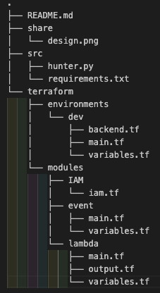
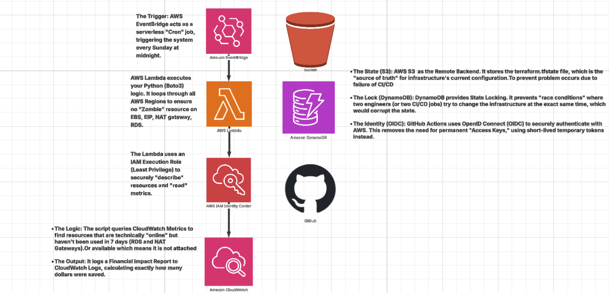

[](https://github.com/iEric0228/finops-zombie-hunter/actions)
[](https://aws.amazon.com/)
[](https://terraform.io/)
[]()

# FinOps Zombie Hunter
**An automated AWS cost-optimization engine that identifies and cleans up unattached resources**

---

## The Business Problem
Cloud waste costs companies billions. Developers often delete EC2 instances but forget to delete the associated EBS, NAT gateway, RDS Database, Elastic IPs leading to "Zombie" resources that continue to bill the company every month.

**This project automates the identification and (optional) deletion of these resources, providing clear visibility into monthly cost savings.**

## Tech Stack
- **Cloud:** AWS (Lambda, EventBridge, CloudWatch)
- **IaC:** Terraform (S3 Backend + DynamoDB State Locking)
- **Logic:** Python 3.12 (Boto3 SDK, OS)
- **CI/CD:** GitHub Actions (OIDC Authentication)

## File Structure


## Architecture Design


The system follows a modular, serverless architecture:
1. **Trigger:** EventBridge Rule configured with `cron(0 0 ? * SUN *)`.
2. **Compute:** AWS Lambda running Python 3.12, modularized to scan multiple services.
3. **Cross-Region Logic:** The script dynamically fetches all enabled AWS regions and performs a local audit in each.
4. **Data-Driven Audit:** Unlike simple status checks, the engine queries **CloudWatch Metrics** to identify idle RDS and NAT Gateways based on actual usage patterns.
5. **State Management:** Terraform Remote State is persisted in S3 with DynamoDB for state locking to ensure CI/CD integrity.

## Best Practices
- **Modular IaC:** Infrastructure is split into reusable modules (`lambda`, `events`, `iam`), allowing for independent scaling and testing.
- **Identity Federation (OIDC):** Eliminated static AWS credentials by using GitHub Actions as a trusted OIDC identity provider.
- **Shift-Left Security:** Integrated `tfsec` and `flake8` into the CI pipeline to catch security misconfigurations and code smells before deployment.
- **Cost Awareness:** The system provides a granular financial breakdown (EBS vs RDS vs NAT) in the final execution report.
- **Atomic Refactoring:** Used Terraform `moved` blocks to transition from a monolithic to a modular structure without resource destruction.

## Sample Execution Log
```json
{
  "timestamp": "2024-01-15T00:00:00Z",
  "regions_scanned": ["us-east-1", "us-west-2", "eu-west-1"],
  "zombie_resources": {
    "ebs_volumes": 12,
    "nat_gateways": 2,
    "elastic_ips": 5,
    "rds_instances": 1
  },
  "estimated_monthly_savings": "$347.50"
}
```

## Getting Started

### Prerequisites
- AWS Account with appropriate IAM permissions
- Terraform >= 1.0
- Python 3.12+
- GitHub account for CI/CD

### Installation
1. Clone the repository:
```bash
   git clone https://github.com/iEric0228/finops-zombie-hunter.git
   cd finops-zombie-hunter
```

2. Configure AWS credentials or set up OIDC authentication

3. Initialize Terraform:
```bash
   terraform init
```

4. Deploy the infrastructure:
```bash
   terraform apply
```
   

### **The Final Step: The Launch**

1.  **Run:** `terraform apply`
2.  **Type:** `yes` (Only when you are sure!)
3.  **Verify:** Log into your AWS Console -> Lambda. You should see "FinOps-Zombie-Hunter" there.
4.  **Test:** Create a small (1GB) EBS volume in the AWS Console. Don't attach it to anything. Wait 2 minutes, then manually "Test" your Lambda function. 

## Author

**Eric Chiu**

- Portfolio: [Deploy on Demand](https://github.com/iEric0228/cloud-resume)
- LinkedIn: [Eric Chiu](https://www.linkedin.com/in/eric-chiu-a610553a3/)
- GitHub: [@iEric0228](https://github.com/iEric0228)
- Email: ericchiu0228@gmail.com

